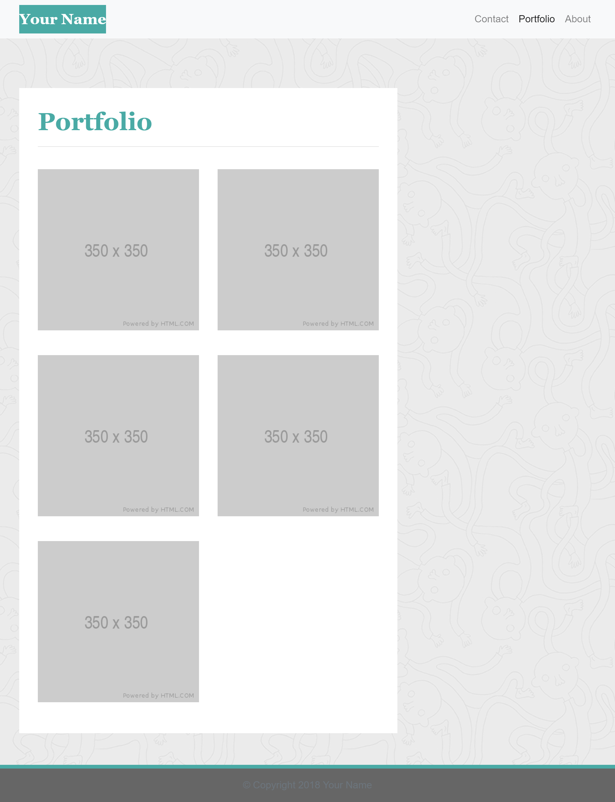
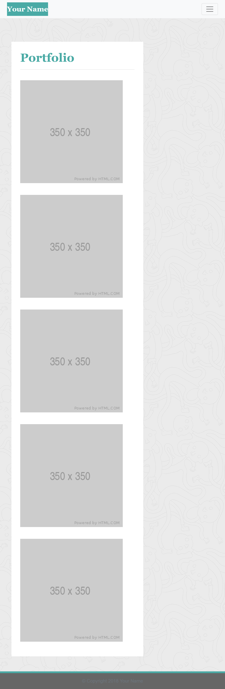

# Responsive Portfolio

As a student, this homework is to create 3 webpages using Bootstrap CSS Framework to create a mobile responsive portfolio. Bootstraps were used for navbar, grid system, responsive layout and responsive images.

## Installation

1. Download or clone repository
2. Open index.html on your browser to view webpage

## Websites
* Github: https://github.com/mmeii/2-responsive-portfolio
* Deploayed: https://mmeii.github.io/2-responsive-portfolio/

## Outcome

The page layouts should look like the screenshots below on different screens

* on 992px screens
    

    

    

* on 768px screens
    

    

    

* on 400px screens
    

    
    
    

## Usage
All images used on the websites are taken by me. Please site source if you use any.

## License
MIT

